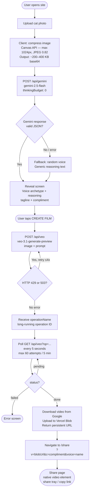

# Cats Will Say Anything — Pipeline

> Temptations branded experience: upload a cat photo → AI assigns a voice archetype → Google Veo generates a short film of that cat pressing a Temptations button → shareable link.

---

## End-to-End Flow



---

## Step-by-Step Detail

### 1 — Image Upload & Compression
**Where:** Browser (client-side)  
**File:** `src/CatsWillSayAnything.jsx` → `handleFile()`

| What happens | Detail |
|---|---|
| User drops or selects a photo | Any image format accepted |
| Canvas resize | Max dimension 1024px, aspect ratio preserved |
| Re-encode | JPEG at quality 0.82 |
| Store as state | `imageBase64` (base64 string) + `imageMimeType: "image/jpeg"` |

**Why compress:** Raw phone photos are 2–5 MB. As JSON base64 that's 6–7 MB, which exceeds Vercel's serverless function body limit (4.5 MB). Compressed output is ~200–400 KB.

---

### 2 — Cat Analysis
**Where:** Server  
**File:** `api/gemini.js`  
**Endpoint:** `POST /api/gemini`

**Request from client:**
```json
{
  "contents": [{
    "parts": [
      { "inlineData": { "mimeType": "image/jpeg", "data": "<base64>" } },
      { "text": "<analysis prompt>" }
    ]
  }],
  "generationConfig": { "temperature": 0.9, "maxOutputTokens": 512 }
}
```

**Server call:** `gemini-2.5-flash` via `generativelanguage.googleapis.com/v1beta` with `thinkingConfig: { thinkingBudget: 0 }` forced on (disables thinking tokens for fast response, ~2s).

**Prompt asks Gemini to:**
- Assign ONE of 5 voice archetypes based on the cat's vibe, expression, posture
- Write 2–3 funny observational sentences explaining why
- Write a punchy tagline (max 8 words)
- Respond as raw JSON only

**Response parsed:**
```json
{
  "voice": "French Smooth Talker",
  "reasoning": "This cat has clearly survived on disappointment and good cheese...",
  "tagline": "Unknowable. Possibly judging everyone."
}
```

**Fallback:** If Gemini fails or JSON parse fails, a random voice is assigned with hardcoded generic reasoning. The user still sees the reveal screen.

---

### 3 — Reveal Screen
**Where:** Browser  
**File:** `src/CatsWillSayAnything.jsx`

Displays in a timed sequence (revealStep 1→2→3):
1. Assigned voice archetype + emoji badge
2. Tagline + reasoning card
3. "What your cat will say" — the hardcoded compliment for that voice
4. **CREATE FILM** button + **Try another cat** link

---

### 4 — Video Generation (start)
**Where:** Server  
**File:** `api/veo.js`  
**Endpoint:** `POST /api/veo`

**Request from client:**
```json
{
  "imageBase64": "<compressed cat photo>",
  "imageMimeType": "image/jpeg",
  "voiceStyle": "a silky French-accented voice, existentially resigned...",
  "compliment": "I have seen you cry at the television..."
}
```

**Prompt built server-side:**
> *"The cat from the reference photo walks slowly across a bright solid yellow background toward a large circular button on the floor. The button is yellow and red, branded with the Temptations logo…"*  
> *(+ voice description + compliment line)*

**API call:**
```
POST generativelanguage.googleapis.com/v1beta/models/veo-3.1-generate-preview:predictLongRunning
```

**Retry logic:** If response is HTTP 429 or 503 (capacity), retries up to 4 times with 4s, 8s, 12s backoff.

**On success:** Returns `operationName` (long-running operation ID) to the client.

---

### 5 — Video Generation (poll)
**Where:** Server  
**File:** `api/veo.js`  
**Endpoint:** `GET /api/veo?op={operationName}`

Client polls every 5 seconds, max 60 attempts (5 minutes).

```
GET generativelanguage.googleapis.com/v1beta/{operationName}
```

**Responses:**
| `done` field | Action |
|---|---|
| `false` | Return `{ status: "pending" }` — client waits 5s, polls again |
| `true` | Extract video (GCS URI or base64), upload to Vercel Blob, return `{ status: "done", url }` |
| Error in response | Return `{ status: "failed", error: "..." }` |

**Video extraction:** Handles two response shapes from Google:
- `response.generateVideoResponse.generatedSamples[0].video.uri` (GCS URI)
- `response.generatedSamples[0].video.bytesBase64Encoded` (inline)

**Vercel Blob upload:** Stores as `cats/{randomHex}.mp4`, public access, returns a persistent CDN URL.

---

### 6 — Share Page
**Where:** Browser  
**File:** `src/SharePage.jsx`  
**Route:** `/share?v=<blobUrl>&c=<compliment>&voice=<voiceName>`

| Element | Detail |
|---|---|
| Video player | Native `<video>` element, autoplay, controls |
| Compliment | Displayed below video |
| Share button | Web Share API if available, clipboard fallback |
| "Make yours" | Links back to `/` |

---

## Voice Archetypes

| Voice | Emoji | ElevenLabs style description used in Veo prompt |
|---|---|---|
| Barry White Core | 🎵 | Deep velvety Barry White baritone, long deliberate pauses |
| French Smooth Talker | 🥐 | Silky French accent, existentially resigned |
| Noir Detective | 🔦 | Gravelly world-weary film noir, raspy and slow |
| Latin Lothario | 🌹 | Passionate telenovela-dramatic, Spanish endearments |
| 90s R&B Slow Jam | 🕯️ | Smooth breathy Boyz II Men falsetto, achingly sincere |

---

## Infrastructure

| Component | Service | Notes |
|---|---|---|
| Frontend | Vercel (static) | Vite + React SPA |
| API functions | Vercel Serverless | Node.js, ES modules |
| Cat analysis | Google Gemini 2.5 Flash | `GOOGLE_API_KEY` |
| Video generation | Google Veo 3.1 | `GOOGLE_API_KEY` (paid preview) |
| Video storage | Vercel Blob | `BLOB_READ_WRITE_TOKEN` (auto-injected when store is linked) |

**Function timeouts:**
- `api/gemini.js` — 30s max
- `api/veo.js` — 60s max (start only; polling is client-driven)

---

## Error States

| Error | Cause | Handling |
|---|---|---|
| Analysis fallback | Gemini parse failure / network | Random voice assigned, generic text shown |
| "Film studio is busy" | Veo 429/503 after 4 retries | User sees friendly message, can retry |
| "[specific error]" | Any other Veo failure | Raw error shown in error box |
| Generation timeout | >5 min with no result | "Generation timed out" message |
